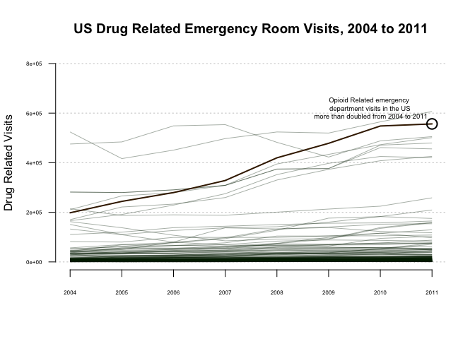

Part 3: Line Graph -Drug Related Emergency Department Visits in the US from 2004-2011
================
Erin Hutcheson
February 24, 2018

### source: <https://www.samhsa.gov/data/emergency-department-data-dawn/reports>

### data: National Estimates of Drug-Related Emergency Department Visits, 2004-2011 - All Misuse and Abuse

``` r
library(dplyr)
```

    ## 
    ## Attaching package: 'dplyr'

    ## The following objects are masked from 'package:stats':
    ## 
    ##     filter, lag

    ## The following objects are masked from 'package:base':
    ## 
    ##     intersect, setdiff, setequal, union

``` r
library(reshape)
```

    ## 
    ## Attaching package: 'reshape'

    ## The following object is masked from 'package:dplyr':
    ## 
    ##     rename

### 1. Wrangling the data

``` r
setwd("/Users/erinhutcheson/Desktop/r1")

# The file starts with 6 blank rows before the header, so when loading it, I utilize the command "skip = 6" in order to delete the rows.  Also, in place of NA this file uses *.   I am replacing * with NA

emergencyroom <- read.csv("EmergencyRoom.csv", skip=6, na.strings = c("*"), header=TRUE,  stringsAsFactors=FALSE, sep=",", colClasses=c("Drugs"="character"))


# I am limiting the dataset to the columns that I need.  That would be the drugs column and the years.  I am changing the names of the columns, because to shape the data to create this particular graph, these columns need to be listed as years.  I am removing the first and last three observations because they talk about general drug use or give instructions.  I want this graph to focus on specific drug use.  For this reason, I have also removed the observations "Non-alcohol illicits", "OTHER SUBSTANCES", "CNS AGENTS", Analgesics, and "Alcohol" because they are umbrella categories that encompass more than one drug.  For instance, "Alcohol" encompasses "Alcohol-alone" and "Alcohol-in-combination"


ER <- emergencyroom %>%
  dplyr::select (Drugs:Estimates.2011) %>%
  dplyr::slice(4:575) %>% 
  dplyr::rename("2004"="Estimates.2004", "2005"="Estimates.2005", "2006"="Estimates.2006", "2007"="Estimates.2007", "2008"="Estimates.2008", "2009"= "Estimates.2009", "2010" = "Estimates.2010", "2011"="Estimates.2011")%>%
  dplyr::filter(!Drugs %in% c("Non-alcohol illicits", "OTHER SUBSTANCES", "CNS AGENTS", "Analgesics", "Alcohol"))
  


# I am omitting NAs because the graph will not allow me to highlight certain lines when NAs are present.


ER <- na.omit(ER)  
```

### 2. Making sure that the data is numeric

``` r
write.csv(ER, "ER.csv")

ER <- readr::read_csv("ER.csv")
```

    ## Warning: Missing column names filled in: 'X1' [1]

    ## Parsed with column specification:
    ## cols(
    ##   X1 = col_integer(),
    ##   Drugs = col_character(),
    ##   `2004` = col_number(),
    ##   `2005` = col_number(),
    ##   `2006` = col_number(),
    ##   `2007` = col_number(),
    ##   `2008` = col_number(),
    ##   `2009` = col_number(),
    ##   `2010` = col_number(),
    ##   `2011` = col_number()
    ## )

    ## Warning: Missing column names filled in: 'X1' [1]

    ## Parsed with column specification:
    ## cols(
    ##   X1 = col_integer(),
    ##   Drugs = col_character(),
    ##   `2004` = col_number(),
    ##   `2005` = col_number(),
    ##   `2006` = col_number(),
    ##   `2007` = col_number(),
    ##   `2008` = col_number(),
    ##   `2009` = col_number(),
    ##   `2010` = col_number(),
    ##   `2011` = col_number()
    ## )

### 3. Creating the line graph

``` r
# In order to create the graph the data has to be in the form of a dataframe.

ER <- as.data.frame(ER)

# We are reshaping the data so that it is in the format of Drugs, Variable (Year), Value.  This is the format that we need for this graph.

ER2 <- melt(ER, id=c("X1", "Drugs"))

# First we must set the parameters to the plot.   The Y limit is 800,000.00 because the maximum amount of visits for any drug in a year is a little under 800,000.00.

plot(0, 0, type="n", xlim=c(2004, 2011), ylim=c(0, 800000), main="US Drug Related Emergency Room Visits, 2004 to 2011", ylab="Drug Related Visits", xlab="", las=1, lwd=2, bty="n", cex.axis=0.5)
grid(NA, NULL, lwd=1.2)

# Then we use a loop to add a line for each country

codes <- unique(ER2$X1)
for (i in 1:length(codes)) {
  currDrug <- subset(ER2, X1 == codes[i])
  currDrug <- currDrug[order(currDrug$variable, decreasing=FALSE),]
  
  lines(2004:2011, currDrug$value, col="#00200070", lwd=0.8)
}

# Make Opiood line more obvious.

currDrug <- subset(ER2, X1 == "46")
currDrug <- currDrug[order(currDrug$value, decreasing=FALSE),]
lines(2004:2011, currDrug$value, col="#402000", lwd=2)


# Annotate

text(2009 + .8, max(currDrug$value) + 120000, "Opioid Related emergency \n department visits in the US \n more than doubled from 2004 to 2011", cex= .6, font=6, pos=1)
symbols(2011, max(currDrug$value), circles=0.1, inches=FALSE, add=TRUE, lwd=2)
```


